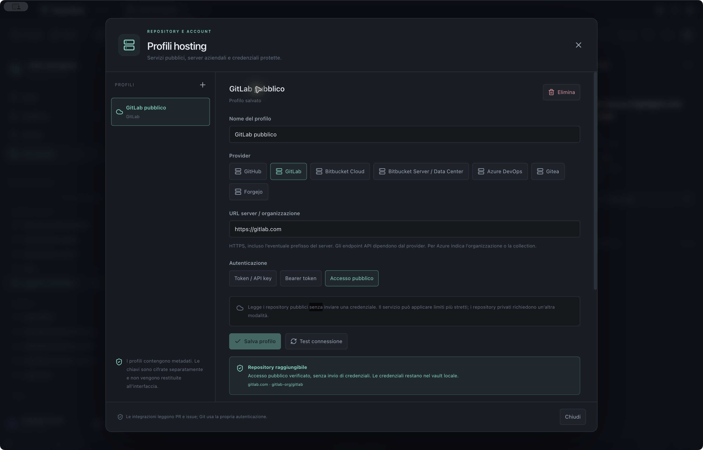

# Branchline

A local-first Git desktop client. See your commit graph, prepare changes, manage branches, and use a real terminal in one workspace. The current source has native verification lanes for macOS, glibc Linux and Windows on x64 and arm64; see [platform scope and acceptance checks](docs/PLATFORMS.md). The published download below is the historical macOS Apple Silicon release.

Branchline runs Git on your computer. Its demo is a real, isolated repository with branches, merges, tags, stashes, worktrees, and a local remote, so you can try the workflow before opening your own projects.


## What you can do

- Explore the commit graph with complete, wrapping reference chips, inspect formatted commit messages, and search by message, author, or SHA.
- Stage files or individual hunks, compare unified and split diffs, and create commits.
- Work with branches, tags, stashes, remotes, worktrees, and Git's merge, rebase, cherry-pick, revert, and reset operations. Double-click a branch to check it out, or open a commit through an explicit detached-HEAD dialog.
- Resolve conflicts in an editable ours/theirs view, including modify/delete conflicts.
- Compare references, inspect file history and blame, plan an interactive rebase, and import or export patches.
- Use guarded undo/redo, recovery copies for discarded changes, autostash enabled by default for checkout/merge/rebase/pull, and an activity log with command output.
- Open a native terminal, switch themes, and browse pull or merge requests through GitHub, GitLab, Bitbucket Cloud/Server, Azure DevOps, Gitea, or Forgejo. Hosting profiles support public services and enterprise servers; issue support depends on the provider.
- Optionally ask an AI model for a commit message or review of a diff. Local models and cloud providers are both configurable; suggestions remain text for you to review.

English is the default interface language. Choose **English, Italiano, Español, Français, Deutsch, Português (Brasil), 日本語, or 简体中文** from **Preferences → Interface language**, the first preference. The language button in the header opens the same selector. Your choice applies immediately and is saved for the next launch.

See the [practical guide](docs/GUIDE.md) for examples using the English interface.

View the native preference screen in [Deutsch](docs/screenshots/preferences-de.jpg) or [简体中文](docs/screenshots/preferences-zh.jpg).

## Install on macOS

Download [Branchline 0.4.0 for Apple Silicon](https://github.com/Hexecu/branchline/releases/download/v0.4.0/Branchline-0.4.0-mac-arm64.zip) and its [SHA-256 checksum](https://github.com/Hexecu/branchline/releases/download/v0.4.0/Branchline-0.4.0-mac-arm64.zip.sha256). Extract the ZIP, move **Branchline.app** into **Applications**, and open it.

To check the download, keep both files in the same folder and run:

```sh
shasum -a 256 -c Branchline-0.4.0-mac-arm64.zip.sha256
```

The release is Developer ID signed and notarized by Apple, with a validated stapled ticket. On 2 October 2026, a public HTTPS download passed checksum, signature, ticket and Gatekeeper checks. A controlled quarantine test then launched the app through the normal macOS **Open** confirmation. See [macOS distribution](docs/MACOS.md) and the [validation record](docs/VALIDATION.md) for the exact scope.

## Build and run from source

You need a supported macOS, Windows or glibc Linux desktop, Git, Node.js 22.12 or newer, and npm. From the source checkout, install the dependencies and launch the development app:

```sh
npm ci
npm run dev
```

For a production frontend build:

```sh
npm run build
npm start
```

Create a native application package for the current OS and CPU with:

```sh
npm run package
```

The package is written outside the checkout to the OS temporary directory, or to `BRANCHLINE_PACKAGE_OUTPUT` when set. It checks the actual executable architecture, GPL notices and native PTY runtime. macOS uses ad-hoc signing for local package integrity. Build prerequisites, six native CI targets and verification limits are documented in [PLATFORMS.md](docs/PLATFORMS.md). `npm run package:macos` retains the macOS-only cache/signing path.

The separate `npm run release:macos` workflow uses Developer ID signing and requires Apple notarization, a validated stapled ticket and Gatekeeper assessment before creating its final archive. The real 0.4.0 arm64 release completed these checks. See [macOS distribution](docs/MACOS.md) for the verification process and interactive Keychain setup.

Open the app and choose **Explore the demo**. The **+** beside the repository tabs and the command palette also let you open the isolated demo. Existing demo changes are preserved when you reopen it.

## Prepare a focused commit

Click a changed file to inspect its diff. Use **Stage hunk** to prepare only that block, or the file's **+** button to stage the whole file. Review the staging list, enter a message, and choose **Create commit**. A commit stays local until you push it.


## Hosting profiles

Open **Integrations** to choose a remote, or **Preferences → Hosting profiles** to configure an account or enterprise server. Profiles cover GitHub, GitLab, Bitbucket Cloud/Server, Azure DevOps, Gitea and Forgejo. Bind a saved profile to each repository/remote pair without changing Git's URL or credentials.

Public access can run without a token. Private access uses encrypted credentials or, for GitHub, the existing GitHub CLI login. Integration lists are read-only; supported issue APIs vary by provider. See the [hosting guide](docs/HOSTING.md) for server URLs, authentication modes and limits.



View the [read-only GitLab list](docs/screenshots/hosting-integration.jpg), retrieved for a public remote attached to the isolated demo.

## Optional AI

Configure profiles for **OpenAI, Azure OpenAI, Google AI Studio, Vertex AI, LiteLLM, Amazon Bedrock, Ollama, or an OpenAI-compatible endpoint** such as LM Studio or vLLM. Import `.env` or JSON settings, discover models where supported, or enter an exact model ID manually.

The app shows the selected destination before generation. A cloud profile sends the chosen diff to that provider when you click **Generate suggestion**; a local profile uses its configured local endpoint. Git operations work without AI or a cloud account.

Credentials are encrypted through the operating system and kept separately from profile metadata. Saved secrets are never returned to the interface. See [AI configuration and data handling](docs/AI.md) for authentication, import formats, limits, and test coverage.


## Development and verification

```sh
npm test
npm run build
```

Tests use isolated Git fixtures and mocked AI transports. Passing them does not establish access to every real provider. Native desktop checks, external dependencies, and remaining gaps are recorded in [VALIDATION.md](docs/VALIDATION.md).

The renderer uses React and TypeScript. Electron's main process owns Git, filesystem, terminal, and provider access through an isolated IPC bridge. See the [API contract](API.md), [feature scope](docs/FEATURES.md), and [user guide](docs/GUIDE.md).

Current limits include file/hunk staging rather than individual-line staging, a default graph window of 400 commits with reference-focused navigation, and read-only hosting integrations. Remote Git authentication, GPG signing, Git LFS, and AI providers require their own configuration. See [hosting profiles](docs/HOSTING.md) for remote selection, server URLs, and provider capabilities.

## License

The current original Branchline source, documentation, translations and assets are licensed under [GNU GPL version 3 only](LICENSE), SPDX identifier `GPL-3.0-only`. Copyright (C) 2026 Davide Leopardi. Distributed modified versions must provide their Corresponding Source under GPL-3.0-only; commercial use and redistribution are permitted. See [COPYRIGHT](COPYRIGHT) and [third-party notices](THIRD_PARTY_NOTICES.md) for scope and separate dependency licenses.

The transition applies to the current source and future releases. Previously published versions, including the linked **v0.4.0** application and its source tag, remain under MIT; their existing permissions are unchanged. Future GPL binary releases must offer the exact matching source and build scripts alongside their downloads, following [macOS distribution](docs/MACOS.md#corresponding-source-for-gpl-releases).
