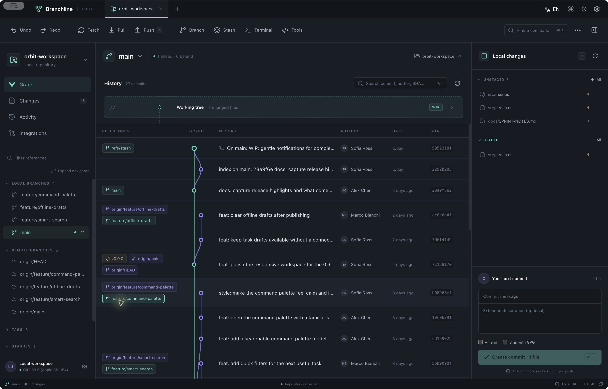
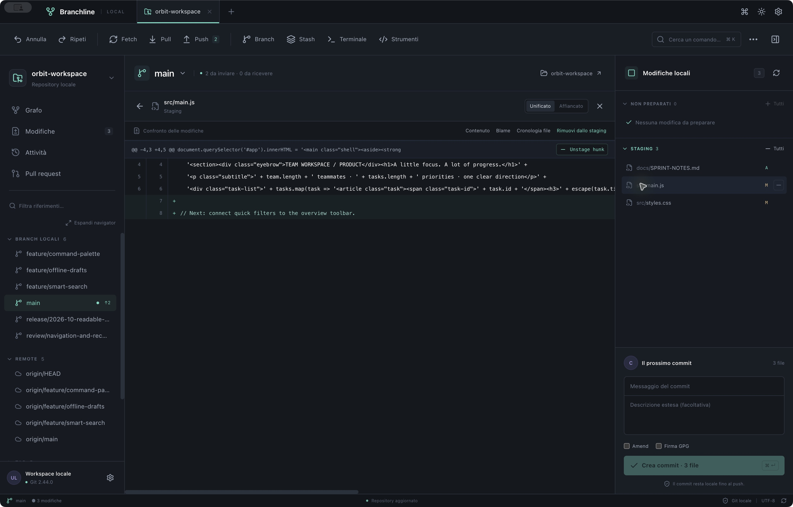
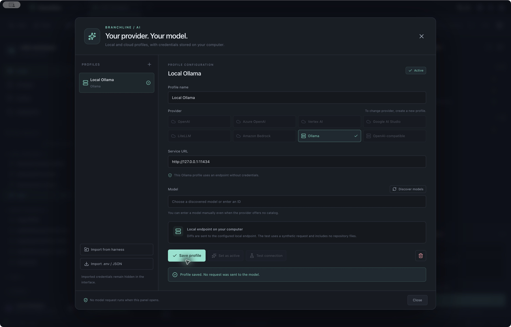

# Branchline user guide

Branchline operates on real local repositories through your installed Git. This guide uses the English interface, which is the default.

## Choose your language

Open the header language button (for example, **EN**) or **Preferences**. **Interface language** is the first preference, with each language listed by its native name: English, Italiano, Español, Français, Deutsch, Português (Brasil), 日本語, and 简体中文.

The selection applies immediately and persists across launches. Dates and numbers follow the selected language. Repository paths, branch names, commit messages, Git commands, and command output keep their original content. Changing the language does not restart an open terminal session.

To run from a source checkout, follow the [README](../README.md#build-and-run-from-source). Local macOS bundles use ad-hoc signing; Developer ID signing and Apple notarization remain pending. See [macOS distribution](MACOS.md) before sharing or installing a downloaded bundle.

## Start with the isolated demo

Choose **Explore the demo** on the welcome screen. If a repository is already open, use the **+** beside its tab and choose **Explore isolated demo**, or search for that action with **⌘K**.

The demo includes multiple branches, merge commits, tags, a stash, an additional worktree, staged and unstaged files, and a bare remote on the same computer. It needs no remote account. Reopening it preserves your work rather than resetting it.

For your own project, use **Open repository** or **⌘O**. **Clone repository** asks for a Git URL and destination; **Create repository** initializes Git in a local directory. Remote authentication uses your Git configuration.

## Find your way around

The left navigator contains the current repository's local branches, remote branches, tags, stashes, and worktrees. Choose **Expand navigator** for more room and wrapping branch names; full names are also available in tooltips. Reference chips in the graph wrap instead of hiding additional labels. Drag the divider at the right edge of **REFERENCES** to resize that column, or focus it and use the left/right arrows. Horizontal scrolling keeps the header and commit columns aligned.

The graph connects commits to their actual parent SHAs, including rows that grow to fit several references. Select a commit to inspect its author, parents, and changed files in the right panel. Messages render basic Markdown: lists, headings, code, emphasis, and HTTPS links. Common emoji aliases such as `:arrow_up:` are displayed as emoji. **Original text** shows the stored message unchanged. Raw HTML and images are not executed or loaded.

**Working tree** selects your local changes. The right panel separates **UNSTAGED** (unstaged files) from **STAGED** (changes prepared for the next commit). A file can appear in both when you have staged part of its changes.

Right-click a file, branch, tag, stash, or commit for contextual actions. Use **⌘K** for the command palette, **⌘F** for commit search, and **⌘R** to refresh the repository. The graph loads 400 commits by default; search covers that loaded window. Selecting a branch, tag, or parent outside it loads a focused history containing that commit and its ancestors, then scrolls to the selection. This is read-only navigation. **All references** returns to the default page; after checkout, that page includes the current HEAD even when a large history would otherwise omit it. The header indicates a focus and whether more commits exist beyond the loaded page.

## Stage a file or one hunk

1. Click a file under **UNSTAGED** to open its diff.
2. Choose **Unified** for one combined view or **Side by side** for old and new content side by side.
3. Click **Stage hunk** above the block you want to include. The action changes Git's index without committing.
4. Check the file under **STAGED**. Its diff shows the prepared changes. **Unstage hunk** removes just that block from the index.

Use a file's **+** button to stage the entire file, **−** to unstage it, or **All** to handle all files in that list. Staging individual lines is not currently supported. Binary and structural file changes may require whole-file staging.

## Create a commit

Enter a short message in **Commit message** and, optionally, a longer description. Review the staging list and press **Create commit**, or **⌘↵**. Only prepared changes go into the commit.

**Amend** replaces the last commit rather than creating a new one; it also allows a message-only amendment. **Sign with GPG** requests signing through your existing Git/GPG setup. A signing key must be configured before using it.

A commit is local until you choose **Push**. **Fetch** updates remote references; **Pull** integrates changes from the upstream branch. Push can set an upstream for a new branch. The force option uses `--force-with-lease` and asks for explicit confirmation.

## Undo, redo, and discarded changes

The toolbar's **Undo** and **Redo** controls provide guarded undo/redo for commit and reset operations performed by Branchline. They are not a general history of every Git command. Branch and HEAD checks prevent replay on a different history; external commands can invalidate an undo entry.

Open **Activity** to inspect actual commands, output, and the repository reflog. If an operation fails, inspect its output before trying another action.

**Discard changes** removes selected working-tree changes after creating a local recovery copy. The result contains a backup ID. To recover it, open **⌘K → Recover discarded changes**, enter that ID, and run the action. Recovery preserves the current versions in another backup first. These copies are local recovery aids, not a replacement for your repository backups.

## Set changes aside with a stash

Use **Stash** in the toolbar. Give the stash a description and choose whether to include untracked files.

In the left **STASHES** section, right-click an entry:

- **Apply stash** restores changes and keeps the stash.
- **Apply and drop** applies it and removes the stash when Git succeeds.
- **Delete stash** removes its reference and requires confirmation.

Applying a stash can produce conflicts. Review the working tree afterwards. **Also restore the staged state of files** requests index restoration as well. The standalone command palette exposes the same stash operations.

## Work with branches and history

Create a branch with **Branch** in the toolbar. Choose its name, starting reference, and whether to switch to it immediately. A single click on a branch selects its head commit. Double-click a local branch in the navigator or its individual graph chip to check out that exact branch. Double-click a remote branch to open local branch creation from that reference. The context menu also offers checkout, merge, rebase, rename, and delete.

Double-click a tag to navigate to its commit. Double-click a commit row, or choose **Open this commit** from its context menu, to open a detached-HEAD checkout dialog. The dialog explains that new commits will not belong to a named branch and offers **Create a branch here** as an alternative. Opening a commit changes the working tree only after confirmation.

Right-click a commit to create a branch or tag at that point, cherry-pick its changes, revert it with a new commit, or reset the current branch to it. Reset has soft, mixed, and hard modes. Read the command preview and confirmation before an operation that rewrites history or removes data.

For interactive rebase, open **Tools → Interactive rebase**, choose a base, and load the commits. Reorder with the arrows and choose `pick`, `reword`, `squash`, `fixup`, or `drop`. A `reword` entry exposes its message field. The current implementation requires a clean working tree and a linear range after the base. It creates a recovery reference before execution. If Git stops on a conflict, resolve it and continue the operation.

## Autostash

Autostash is on by default for checkout, merge, rebase, and pull. **Autostash for checkout, merge, rebase and pull** in Preferences sets the global default; each supported action dialog lets you override it. An explicit disabled setting is respected. With autostash disabled and pending changes, double-clicking a local branch opens its checkout dialog so you can choose how to proceed.

Autostash protects staged changes, unstaged changes, and untracked files before the supported operation, then attempts to restore them afterwards. If a merge or rebase remains in progress, the banner shows the recovery reference and restoration waits until **Continue** or **Abort** succeeds. If restoration produces conflicts, inspect the error and resolve them; the saved entry/reference remains available for manual recovery. A successful restoration keeps the generated stash entry and its recovery reference. Branchline does not automatically drop it, so another process moving stash ordinals cannot cause an unrelated stash to be deleted. You can remove the saved entry explicitly after checking the restored changes.

When no Git operation is awaiting continuation, the banner says manual recovery is required rather than offering an automatic restore after Continue/Abort. Resolve restoration conflicts before applying the stash again. For manual recovery, choose **Manual recovery** in the banner to prefill **Apply stash**, or use the recovery reference/hash from the operation output and enable index restoration to recover the original staging state. Inspect **Activity** for the exact result. Autostash is a protected working-tree workflow, not general undo or a repository backup.

## Resolve a conflict

Click a conflicted file to open the editor. **OURS** and **THEIRS** show the two Git stages; you can choose a whole version or edit the result yourself.

During a rebase, OURS is the new base and THEIRS is the commit being reapplied. During a merge, the labels follow Git's current and incoming versions. For a modify/delete conflict, the editor distinguishes an absent version from an empty file; choose whether to preserve the deletion or keep the content.

Remove all conflict markers, then use **Save and stage** to save the result and stage the resolution. Resolve every conflicted file. The operation banner's **Continue** completes the pending merge, rebase, cherry-pick, or revert. **Abort** aborts it and asks for confirmation.

## Compare references, inspect history, and use patches

In **Tools → Compare**, enter two branches, tags, or commit SHAs and request the diff. Use **File history** for a file's commit history and blame. The file diff toolbar also offers **Contents**, **Blame**, and **File history**.

**Tools → Patch** loads a staged or unstaged diff, imports a `.patch` file, or exports the current text. **Check and apply** checks the patch before applying it locally. This is a local file workflow; there is no cloud patch-sharing service.

**Terminal** opens a real shell in the active repository. Commands there affect the same files and Git history as the UI.

## Configure optional AI

Open **Preferences → Configure AI** or **Tools → AI assistant → AI profiles and models**.

1. Add a profile and select one of the eight providers.
2. Enter the endpoint and authentication fields required by that provider. For a local OpenAI-compatible server, choose **None**, **API key**, or **Bearer token** according to the server configuration.
3. Save the profile. You may leave its model empty while configuring access.
4. Use **Discover models** where supported, or enter the exact model/deployment ID manually. Save again after editing.
5. **Set as active** persists the default profile and model. **Test connection** performs a real inference with a synthetic prompt and no repository content.

A successful catalog request proves that a list was retrieved; it does not prove permission or support for inference with every listed model. The exact ID you choose is used for the request, with no fallback to another model.

**Import .env / JSON** opens a native file picker. Canceling import preserves the existing profiles and active choice. The importer treats file contents as data: it never executes shell commands or expands environment references. Review imported metadata and the active model before testing. See [AI.md](AI.md) for portable examples, all authentication modes, and request limits.

In **AI assistant**, select a profile, model, and request. The destination notice explains where the diff will go. **Generate suggestion** sends the staged diff if staging contains files; otherwise it sends the unstaged diff. Nothing is sent to a model merely by opening this panel. Suggestions remain text, and you decide whether to use them.

Profile metadata and encrypted credentials are stored separately in the app's local data directory. The UI shows whether a credential exists, never its saved value. Leaving credential fields blank preserves saved values; deleting a profile also deletes its stored credentials. OS credential protection must be available—there is no plaintext fallback. The imported source file remains your responsibility and is not modified by the app.

## Optional integrations and verification

Open **Integrations** to select a remote and read its pull/merge requests or supported issues. If a repository has multiple remotes, choose the one you want explicitly. Use **Hosting profiles**, also available from Preferences and the command palette, to configure GitHub, GitLab, Bitbucket Cloud/Server, Azure DevOps, Gitea, or Forgejo.

Add a named profile, choose its provider, and enter the public or enterprise server URL, including any installation prefix. Repository and project identifiers are inferred from the selected Git remote. Azure accepts an organization or collection URL and an optional API version. Select the authentication mode, then save. **Public access** sends no token; private repositories require suitable credentials. GitHub can also use an installed, authenticated `gh` CLI. For Bitbucket Cloud Basic authentication, use the account email and an API token rather than an app password.

**Test connection** reads repository metadata for the saved profile and selected remote. It does not establish write permission or access to every API. **Bind to repository → Save binding** records the profile for that repository and remote without changing Git's URL or credentials. Blank credential fields preserve saved secrets; profile deletion removes its stored credentials and bindings.

Integration results are read-only and open their original links. GitLab uses merge requests; Azure work items are project-level. Unsupported issue APIs show an explanation, and request failures show errors rather than claiming there are no open items. Creating/reviewing requests, editing issues, and Jira/Trello integrations are outside this workflow. Generic Git servers continue to support Git operations even when no hosting API adapter applies. See [HOSTING.md](HOSTING.md) for authentication modes, provider capabilities, and verification boundaries.

Git LFS, GPG, remote Git access, and AI runtimes/providers require their own setup. The feature matrix is in [FEATURES.md](FEATURES.md); tested desktop flows and unresolved checks are separated in [VALIDATION.md](VALIDATION.md).
